# Wazuh SIEM Lab — Offline Install on VirtualBox (Ubuntu Server 22.04)

A single-node Wazuh 4.14.7 SIEM deployment (indexer + manager + dashboard, all-in-one), built entirely offline over a bandwidth-constrained connection, with a Windows PC as the host and a bridged-network VM as the SIEM node. This is repo #2, a companion to [`attack-detect-lab`](https://github.com/hamid0x1/attack-detect-lab/) — the SIEM here is fed real attack traffic from that repo's DVWA setup, and its custom detection rules are compared directly against that repo's `detect.py`.

This document covers the full build: VM creation, OS install, networking, offline package transfer, and the install itself — including the real problems hit along the way and how each was diagnosed and fixed. Nothing here is theoretical; every command below was run and confirmed working on this exact setup.

All screenshots referenced below are in [`/screenshots`](./screenshots) at the repo root.

## Environment

| Component | Detail |
|---|---|
| Host | Windows, VirtualBox |
| Guest OS | Ubuntu Server 22.04.5 LTS (Jammy) |
| VM name | `wazuh-ubu-22.04.5` |
| VM specs | 8192 MB RAM, 2 vCPU, 50 GB disk (dynamically allocated) |
| Network mode | Bridged Adapter (tethered via Olax M100 pocket router) |
| VM static IP | `192.168.8.21` |
| Wazuh version | 4.14.7 (all-in-one deployment: indexer, manager, dashboard on one host) |
| Install method | Fully offline — packages pre-downloaded on a separate internet-connected machine, transferred via SCP |

> **Note — VM name vs. hostname are intentionally different, not a typo:** the VirtualBox VM name (`wazuh-ubu-22.04.5`) and the actual Linux hostname (`wazuh-ubu-22045`) are two separate values by design. VirtualBox's VM name is just a label in the Manager UI; the real OS hostname is set during install and is what Wazuh actually reports (e.g. in the dashboard's `manager.name` field). Hostnames can't contain dots the way a display name can — dots are reserved as domain separators in a proper FQDN — so the dots were dropped when the hostname was typed in Subiquity. Nothing was misconfigured; expect `manager.name` in the dashboard to show the no-dots version.

---

## 1. Create the VM

**VirtualBox → Machine → New**
- Name: `wazuh-ubu-22.04.5`, Type: Linux, Version: Ubuntu (64-bit)
- Memory: 8192 MB
- CPU: 2 vCPUs
- Hard disk: new VDI, dynamically allocated, 50 GB

**Settings → Storage** — attach the Ubuntu Server 22.04.5 ISO to the optical drive.

**Settings → Network → Adapter 1**
- Attached to: **Bridged Adapter**
- Name: the physical adapter used for internet (in this case, the USB-C tether to the Olax M100 — *not* the WiFi adapter)

This puts the VM on the same subnet as the rest of the LAN, which is required for SSH and browser access from the host later.

---

## 2. Install Ubuntu Server (Subiquity, terminal-only)

Fully keyboard-driven installer, no mouse needed:

1. Language → English
2. Keyboard → default
3. Installer update → accept if offered
4. Type of install → **Ubuntu Server** (not minimized)
5. Network connections → should show an interface with an IP from the bridged subnet automatically
6. Proxy → leave blank
7. Mirror → leave default
8. Storage → **Use an entire disk** (LVM checked) → confirm destructive action → Continue
9. Profile setup → hostname `wazuh-ubu-22045`, username `waz-mngr`, set a password
10. Ubuntu Pro → skip
11. SSH Setup → **check "Install OpenSSH server"** — this is what lets you work from a real terminal instead of the tiny VirtualBox console window
12. Featured Server Snaps → skip all
13. Install runs → reboot when prompted

---

## 3. Networking — getting a real, persistent IP

### Problem: no network at all after first boot

Ping failed immediately post-install (`Temporary failure in name resolution`, `Network is unreachable`).

**Root cause:** the Bridged Adapter in VirtualBox had no `VirtualBox NDIS6 Bridged Networking Driver` bound to the physical host adapter — it was missing entirely.

**Fix:** on the Windows host — **Control Panel → Network and Sharing Center → Change adapter settings** → right-click the physical adapter used for internet (the USB-C tether adapter, not WiFi) → **Properties** → checked the `VirtualBox NDIS6 Bridged Networking Driver` entry in the list (it was present but unchecked/unbound). If the entry is missing entirely rather than just unchecked, it can be reinstalled by pointing **Install → Have Disk** at:
```
C:\Program Files\Oracle\VirtualBox\drivers\network\netlwf
```
Restarted the Windows host after. After that, the VM picked up a real link.

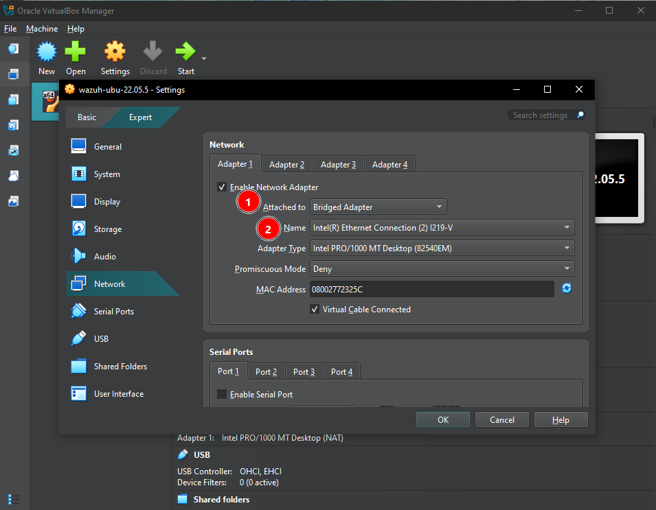

Bring the interface up manually to confirm:
```bash
ip addr show
sudo ip link set <interface_name> up
sudo dhclient <interface_name>
```

### Problem: static IP kept reverting on reboot

**Root cause:** Ubuntu Server's `cloud-init` regenerates `/etc/netplan/50-cloud-init.yaml` on every boot, silently overwriting any manual static IP edits.

**Fix:**
```bash
sudo apt purge cloud-init -y
sudo rm -rf /etc/cloud/ /var/lib/cloud/
```

Then create a clean static config:
```bash
sudo nano /etc/netplan/01-netcfg.yaml
```
```yaml
network:
  version: 2
  ethernets:
    enp0s3:
      dhcp4: false
      addresses:
        - 192.168.8.21/24
      gateway4: 192.168.8.1
      nameservers:
        addresses: [1.1.1.1, 8.8.8.8]
```
```bash
sudo netplan apply
sudo reboot
```

Verify after reboot:
```bash
ip a | grep enp0s3
```

### SSH access from the host

```bash
sudo apt update && sudo apt install openssh-server -y
sudo systemctl enable ssh --now
sudo systemctl status ssh
sudo ufw allow 22
```

From the Windows host:
```powershell
ssh waz-mngr@192.168.8.21
```
(type the full word `yes` at the fingerprint prompt — anything shorter fails host-key verification)

---

## 4. Getting the offline install files onto the VM

The offline Wazuh packages (`wazuh-install.sh`, `wazuh-certs-tool.sh`, `config.yml`, and the four `.deb` packages — indexer, manager, dashboard, filebeat) were pre-downloaded on a separate internet-connected machine and staged in a local folder (`D:\VirtualBox\1shared`) the night before.

### Attempted approach: VirtualBox Shared Folders + Guest Additions

Tried installing Guest Additions via apt (`virtualbox-guest-dkms`) to mount a shared folder directly. This hit a dead end — the package wasn't resolvable even with `universe` enabled, and chasing kernel-header/dkms build issues wasn't worth it for a one-time file transfer.

### What actually worked: plain SCP

Since SSH was already working, the files were pushed straight from the Windows host to the VM instead:

```powershell
scp -r D:\VirtualBox\1shared\* waz-mngr@192.168.8.21:~/1shared
```

Notes:
- `-r` is required for recursive copy — without it, `scp` fails on any subfolder with `is not a regular file`
- The destination folder on the VM (`~/1shared`) should exist beforehand (`mkdir -p ~/1shared`)
- `scp` behaves like `cp`, just tunneled over SSH — same flags, same logic, just needs `user@host:path` for the remote side

Files were then moved into a working directory:
```bash
mkdir -p ~/wazoff
mv ~/1shared/* ~/wazoff/
cd ~/wazoff
```

### How the offline packages were actually fetched

Since the manager VM had no internet during install, the six install artifacts (`wazuh-install.sh`, `wazuh-certs-tool.sh`, `config.yml`, and the indexer/manager/dashboard/filebeat `.deb` packages, plus the Windows agent `.msi` for completeness) were pre-downloaded using a phone as the only device with a reliable connection at the time — then transferred to the Windows staging folder and on to the VM via the SCP flow above.

The download script is deliberately inert: it only downloads and bundles files into a single `.tar.gz`, it never runs `wazuh-install.sh` or `wazuh-certs-tool.sh` itself, and it doesn't touch `apt` or `systemd`. See [`scripts/wazuh-4.14.7-offline-downloader.sh`](./scripts/wazuh-4.14.7-offline-downloader.sh) for the full script.

Note: the script fetches a Windows agent `.msi` that ended up unused — the actual agent (section 15) was installed inside WSL2 via `apt`, not this Windows binary. Kept in the bundle anyway since it was downloaded as part of the same offline batch.

---

## 5. Configure `config.yml` for all-in-one deployment

```bash
cat config.yml
```
Default file has placeholder IPs (`<indexer-node-ip>`, `<wazuh-manager-ip>`, `<dashboard-node-ip>`). Since indexer, manager, and dashboard all live on this single VM, all three are set to loopback:

```yaml
nodes:
  indexer:
    - name: node-1
      ip: "127.0.0.1"

  server:
    - name: wazuh-1
      ip: "127.0.0.1"

  dashboard:
    - name: dashboard
      ip: "127.0.0.1"
```

---

## 6. Generate certificates

```bash
chmod +x wazuh-certs-tool.sh
sudo ./wazuh-certs-tool.sh -A
```

`-A` generates certs for all components in one pass based on `config.yml`. Output lands in `wazuh-certificates/`:
- `root-ca.pem` / `root-ca.key`
- `node-1.pem` / `node-1-key.pem` (indexer)
- `wazuh-1.pem` / `wazuh-1-key.pem` (manager)
- `dashboard.pem` / `dashboard-key.pem`
- `admin.pem` / `admin-key.pem`

---

## 7. Install the Wazuh indexer

```bash
sudo dpkg -i wazuh-indexer_4.14.7-1_amd64.deb
```
Installs clean with no external dependency errors — the indexer package bundles its own JDK.

Deploy certs:
```bash
sudo mkdir -p /etc/wazuh-indexer/certs
sudo cp ~/wazoff/wazuh-certificates/node-1.pem /etc/wazuh-indexer/certs/indexer.pem
sudo cp ~/wazoff/wazuh-certificates/node-1-key.pem /etc/wazuh-indexer/certs/indexer-key.pem
sudo cp ~/wazoff/wazuh-certificates/admin.pem /etc/wazuh-indexer/certs/
sudo cp ~/wazoff/wazuh-certificates/admin-key.pem /etc/wazuh-indexer/certs/
sudo cp ~/wazoff/wazuh-certificates/root-ca.pem /etc/wazuh-indexer/certs/
sudo chmod 500 /etc/wazuh-indexer/certs
sudo bash -c 'chmod 400 /etc/wazuh-indexer/certs/*'
sudo chown -R wazuh-indexer:wazuh-indexer /etc/wazuh-indexer/certs
```

**Gotcha:** `chmod 500` on the directory *before* globbing `certs/*` in a non-root shell will make the wildcard silently match nothing (your shell expands `*` before `sudo` runs, and it can no longer see inside the now-locked directory). Fix: run the glob inside `sudo bash -c '...'` so root does the expansion.

Start it:
```bash
sudo systemctl daemon-reload
sudo systemctl enable wazuh-indexer
sudo systemctl start wazuh-indexer
sudo systemctl status wazuh-indexer
```

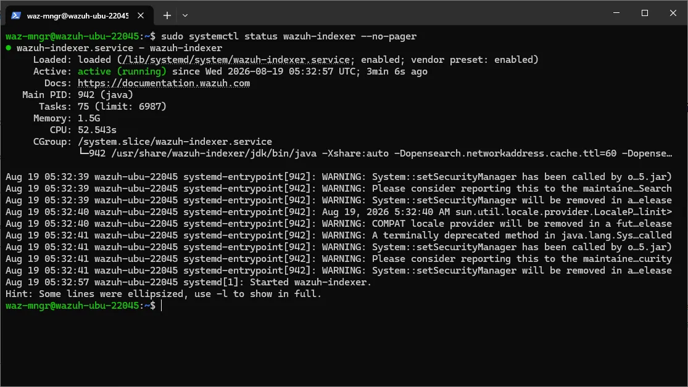

Initialize the security index:
```bash
sudo /usr/share/wazuh-indexer/bin/indexer-security-init.sh
```

Confirm the API responds:
```bash
curl -k -u admin:admin https://127.0.0.1:9200
```
Expected: JSON with `cluster_name`, `version`, etc.

---

## 8. Disk space crisis — LVM only allocated half the disk

Partway through, the indexer install + package files filled the disk completely: `df -h /` showed `24G / 24G used, 0 available`, despite the VM having a 50GB virtual disk.

**Root cause:** Ubuntu Server's guided LVM partitioner ("use entire disk") does **not** actually give the logical volume the entire disk by default — it left roughly half of it unallocated in the volume group, for no real benefit on a single-VM lab.

```bash
sudo vgs
```
```
VG        #PV #LV #SN Attr   VSize   VFree
ubuntu-vg   1   1   0 wz--n- <48.00g 24.00g
```
Confirms it: 24GB of the 48GB disk was sitting unused.

**Wrinkle:** with the disk at *exactly* 0 bytes free, `lvextend` itself failed —
```
/etc/lvm/archive: mkdir failed: No space left on device
```
LVM couldn't even write its own tiny metadata backup file before making the change.

**Fix:** freed a small amount of space first by deleting already-installed `.deb` files (no longer needed once a package is installed):
```bash
rm ~/wazoff/wazuh-indexer_4.14.7-1_amd64.deb
rm ~/wazoff/wazuh-manager_4.14.7-1_amd64.deb
rm ~/wazoff/filebeat_7.10.2-2_amd64.deb
```

That was enough headroom for LVM to write its metadata, so the extend worked:
```bash
sudo lvextend -l +100%FREE /dev/ubuntu-vg/ubuntu-lv
sudo resize2fs /dev/mapper/ubuntu--vg-ubuntu--lv
df -h /
```
Result: full 48GB usable, no reboot or data loss required.

---

## 9. Install the Wazuh manager

```bash
sudo dpkg -i wazuh-manager_4.14.7-1_amd64.deb
sudo systemctl daemon-reload
sudo systemctl enable wazuh-manager
sudo systemctl start wazuh-manager
sudo systemctl status wazuh-manager
```
Clean install, no dependency issues. All manager daemons (`wazuh-analysisd`, `wazuh-remoted`, `wazuh-authd`, `wazuh-modulesd`, etc.) start under one systemd unit.

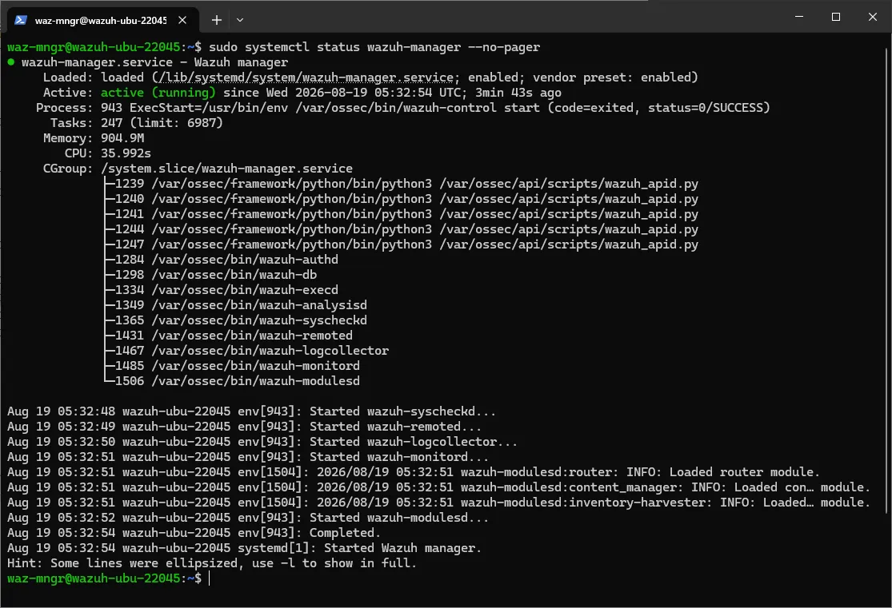

---

## 10. Install and configure Filebeat

Filebeat ships alerts from the manager into the indexer. The offline bundle didn't include the Wazuh-specific Filebeat module or index template, so — since the VM had internet by this point — those two were pulled directly:

```bash
sudo dpkg -i filebeat_7.10.2-2_amd64.deb

sudo curl -so /etc/filebeat/wazuh-template.json https://raw.githubusercontent.com/wazuh/wazuh/v4.14.7/extensions/elasticsearch/7.x/wazuh-template.json
sudo chmod go+r /etc/filebeat/wazuh-template.json

sudo curl -s https://packages.wazuh.com/4.x/filebeat/wazuh-filebeat-0.4.tar.gz -o /tmp/wazuh-filebeat-0.4.tar.gz
sudo tar -xzf /tmp/wazuh-filebeat-0.4.tar.gz -C /usr/share/filebeat/module
```

Config (`/etc/filebeat/filebeat.yml`):
```yaml
filebeat.inputs:
- type: log
  paths:
    - /var/ossec/logs/alerts/alerts.json

filebeat.modules:
  - module: wazuh
    alerts:
      enabled: true
    archives:
      enabled: false

setup.template.json.enabled: true
setup.template.json.path: '/etc/filebeat/wazuh-template.json'
setup.template.json.name: 'wazuh'
setup.ilm.overwrite: true
setup.ilm.enabled: false

output.elasticsearch:
  hosts: ["127.0.0.1:9200"]
  protocol: https
  username: admin
  password: admin
  ssl.certificate_authorities:
    - /etc/filebeat/certs/root-ca.pem
  ssl.certificate: "/etc/filebeat/certs/filebeat.pem"
  ssl.key: "/etc/filebeat/certs/filebeat-key.pem"
```

Deploy certs (reusing the manager's `wazuh-1` cert pair, since Filebeat runs on the same host):
```bash
sudo mkdir -p /etc/filebeat/certs
sudo cp ~/wazoff/wazuh-certificates/root-ca.pem /etc/filebeat/certs/
sudo cp ~/wazoff/wazuh-certificates/wazuh-1.pem /etc/filebeat/certs/filebeat.pem
sudo cp ~/wazoff/wazuh-certificates/wazuh-1-key.pem /etc/filebeat/certs/filebeat-key.pem
sudo chmod 500 /etc/filebeat/certs
sudo bash -c 'chmod 400 /etc/filebeat/certs/*'
```

```bash
sudo systemctl daemon-reload
sudo systemctl enable filebeat
sudo systemctl start filebeat
```

Test the connection (independent of whether any real alerts exist yet):
```bash
sudo filebeat test output
```
Confirmed: TLS handshake OK, talked to server OK, version 7.10.2 — connection to the indexer was valid.

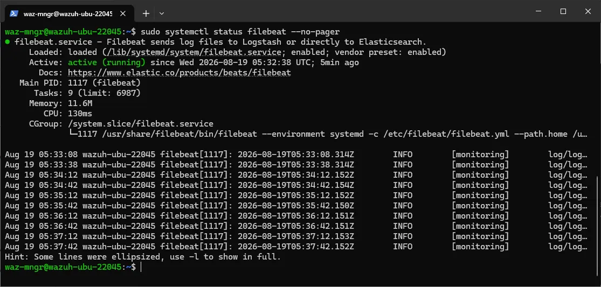

### Problem: Filebeat crash-looping (`pthread_create failed: Operation not permitted`)

Filebeat kept dying with a Go-runtime panic on thread creation. Traced back to the exact moment the disk had hit 0 bytes free during the LVM issue above — its process almost certainly got starved/corrupted mid-run at that point.

**Fix:** the VM was under real memory pressure by this stage (indexer + manager + dashboard + filebeat all competing for 4GB RAM, with only ~106Mi free at one point). Rather than chase kernel-level seccomp/thread-limit tuning, the simpler and more durable fix was giving the VM more headroom:

- Shut the VM down cleanly (`sudo shutdown -h now`)
- **VirtualBox → Settings → System → Motherboard → Base Memory**: increased from 4096 MB to **8192 MB**
- Booted back up, restarted services in order (indexer → manager → dashboard → filebeat), checking `free -h` between each

This resolved the crash — Filebeat came up stable with real headroom instead of contending for the last few hundred MB.

---

## 11. Install the dashboard

```bash
sudo dpkg -i wazuh-dashboard_4.14.7-1_amd64.deb
```

Deploy certs:
```bash
sudo mkdir -p /etc/wazuh-dashboard/certs
sudo cp ~/wazoff/wazuh-certificates/dashboard.pem /etc/wazuh-dashboard/certs/
sudo cp ~/wazoff/wazuh-certificates/dashboard-key.pem /etc/wazuh-dashboard/certs/
sudo cp ~/wazoff/wazuh-certificates/root-ca.pem /etc/wazuh-dashboard/certs/
sudo chmod 500 /etc/wazuh-dashboard/certs
sudo bash -c 'chmod 400 /etc/wazuh-dashboard/certs/*'
sudo chown -R wazuh-dashboard:wazuh-dashboard /etc/wazuh-dashboard/certs
```

`/etc/wazuh-dashboard/opensearch_dashboards.yml` ships almost fully pre-configured (host, SSL paths, CA path already correct out of the box). The only change needed was uncommenting and setting the internal service-account credentials used for the dashboard-to-indexer connection:

```yaml
opensearch.username: kibanaserver
opensearch.password: kibanaserver
```

(This is a separate, fixed default credential from the `admin` account used to actually log into the web UI — not something to choose yourself.)

```bash
sudo systemctl daemon-reload
sudo systemctl enable wazuh-dashboard
sudo systemctl start wazuh-dashboard
sudo systemctl status wazuh-dashboard
```

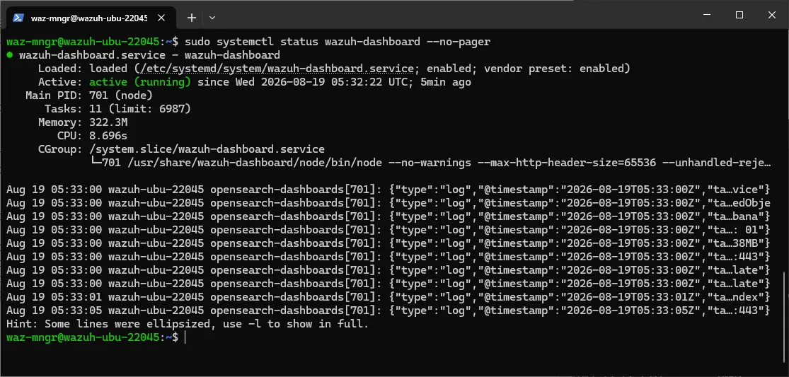

---

## 12. Final blocker — UFW silently dropping the dashboard port

Browsing to `https://192.168.8.21` from the host timed out (`ERR_CONNECTION_TIMED_OUT`) even though `ss -tlnp` confirmed the dashboard's Node process was correctly listening on `0.0.0.0:443`.

**Root cause:** UFW had only ever been opened for port 22 (SSH), back when SSH access was first set up. Port 443 was never explicitly allowed, so UFW dropped it silently — no "connection refused," just a timeout, which is UFW's signature behavior versus an actual closed/non-listening port.

```bash
sudo ufw status
```
```
22    ALLOW    Anywhere
```
Confirmed the gap. Fix:
```bash
sudo ufw allow 443/tcp
sudo ufw status
```

---

## 13. Result

Browsing to `https://192.168.8.21` from the Windows host now loads the Wazuh login screen (self-signed cert warning expected and accepted). Logged in with the default `admin` credentials generated by the certs tool.


Stack fully live: indexer, manager, filebeat, and dashboard all running on a single Ubuntu Server 22.04 VM, entirely offline-installed, reachable over the LAN via a bridged adapter.

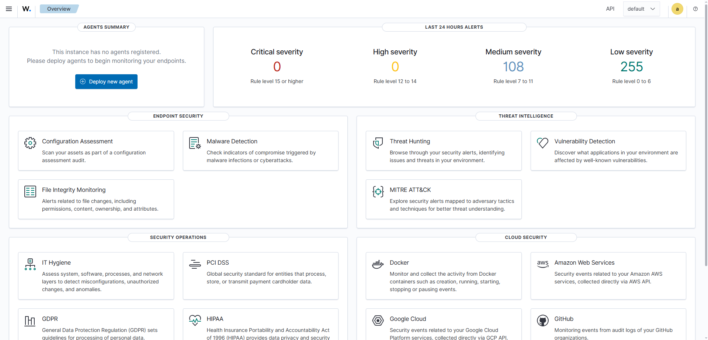

---

## 14. UFW ports — what's open and why

UFW on the manager VM started with nothing open by default. Ports were opened one at a time, each time something failed with a timeout (UFW's signature behavior — a blocked port times out silently, it doesn't refuse the connection the way a closed/non-listening port would). By the end of the build, four ports are open:

| Port | Protocol | Service it's tied to | Why it's needed |
|---|---|---|---|
| 22 | TCP | OpenSSH server | Remote terminal access to the manager VM from the Windows host (used for the whole build instead of the tiny VirtualBox console window, and for SCP file transfer) |
| 443 | TCP | Wazuh dashboard (Node/OpenSearch Dashboards process) | Browser access to the web UI from the host/LAN — blocked initially, caused the `ERR_CONNECTION_TIMED_OUT` issue in section 12 |
| 1514 | TCP | `wazuh-remoted` (manager) | The channel agents use to actually **ship log/event data** to the manager after enrollment |
| 1515 | TCP | `wazuh-authd` (manager) | The **enrollment/registration** channel — where a new agent first registers itself and receives its key. Needed once per agent (or whenever re-enrolling); not used for ongoing log shipping once registered |

Check current state anytime with:
```bash
sudo ufw status numbered
```

Two different Wazuh daemons own 1514 and 1515 — `authd` only cares about the initial handshake, `remoted` is what stays busy for the life of the agent. Both need to be open for a new agent to enroll and then actually start sending data; opening only one gets you a stuck/half-working enrollment.

---

## 15. Enrolling an agent — WSL2 Ubuntu (laptop, [`attack-detect-lab`](https://github.com/hamid0x1/attack-detect-lab/) source)

Rather than a Windows-native agent, the agent was installed **inside WSL2 Ubuntu on the laptop**, because that's where the actual DVWA log file lives ([`attack-detect-lab`](https://github.com/hamid0x1/attack-detect-lab/)`/dvwa/logs/access.log`, populated by `sync-logs.sh` pulling it out of the DVWA Docker container). A Windows-side agent can't natively read a WSL2 filesystem path, so WSL2 — which is just a Linux box on the network via NAT — is the right place for it.

### Confirm reachability first

```bash
ping -c 3 192.168.8.21
nc -zv 192.168.8.21 1515
```
`nc` hanging with no response (rather than an instant success/refusal) was the first sign the manager's UFW hadn't opened 1514/1515 yet — same silent-timeout pattern as the dashboard issue in section 12. Fixed the same way, on the manager:
```bash
sudo ufw allow 1514/tcp
sudo ufw allow 1515/tcp
```

### Install the agent

WSL2 has real internet access via Windows, so this doesn't need the offline `.deb` transfer the manager build required:
```bash
curl -s https://packages.wazuh.com/key/GPG-KEY-WAZUH | sudo gpg --no-default-keyring --keyring gnupg-ring:/usr/share/keyrings/wazuh.gpg --import
sudo chmod 644 /usr/share/keyrings/wazuh.gpg
echo "deb [signed-by=/usr/share/keyrings/wazuh.gpg] https://packages.wazuh.com/4.x/apt/ stable main" | sudo tee /etc/apt/sources.list.d/wazuh.list
sudo apt update
sudo WAZUH_MANAGER='192.168.8.21' apt install wazuh-agent -y
```
The `WAZUH_MANAGER` env var primes `/var/ossec/etc/ossec.conf`'s `<server><address>` field automatically — confirm with:
```bash
sudo grep -A2 "<server>" /var/ossec/etc/ossec.conf
```

### Point it at the DVWA log

Add a new `<localfile>` block inside the existing `<ossec_config>...</ossec_config>` in `/var/ossec/etc/ossec.conf`, alongside the default ones already there (syslog, auth.log, dpkg.log, etc.) — don't replace anything, just add:
```xml
<localfile>
  <log_format>apache</log_format>
  <location>/home/rei/attack-detect-lab/dvwa/logs/access.log</location>
</localfile>
```
Use whatever the real synced path is (`find ~ -iname "access.log" 2>/dev/null` if unsure).

### No systemd in WSL2 — starting the agent manually

WSL2 doesn't run real systemd by default (unless explicitly enabled via `/etc/wsl.conf` → `[boot] systemd=true`). Rather than enabling that, the agent is just started manually with Wazuh's own control script each session:
```bash
sudo /var/ossec/bin/wazuh-control start
```
Check status the same way (not `systemctl`, and not `wazuh-control` bare — it's not on PATH, always use the full path):
```bash
sudo /var/ossec/bin/wazuh-control status
```
Full command reference:
```bash
sudo /var/ossec/bin/wazuh-control {start|stop|restart|status}
```

**For anyone repeating this setup who doesn't want to remember it every boot:** this is a one-line fix if you'd rather have it automatic — set `systemd=true` in `/etc/wsl.conf`, reboot WSL2 (`wsl --shutdown` from PowerShell, then reopen), and Wazuh's own installer-provided `systemd` unit takes over (`sudo systemctl enable wazuh-agent`). Not done here — manual start on demand was fine for lab use since the agent is only needed while actively generating/syncing traffic, not 24/7.

### Confirm it's actually watching the file

```bash
sudo grep -A2 "access.log" /var/ossec/logs/ossec.log
```
Should show a line like:
```
wazuh-logcollector: INFO: (1950): Analyzing file: '/home/rei/attack-detect-lab/dvwa/logs/access.log'.
```

### Generate traffic, sync, verify in the dashboard

```bash
# trigger a payload against DVWA in the browser first, then:
./sync-logs.sh
wc -l /home/rei/attack-detect-lab/dvwa/logs/access.log   # confirm non-zero
```
Then in the dashboard: **Threat Hunting** (or **Discover**) → filter `agent.name` to the laptop's hostname, narrow the time range to the last 15–60 minutes, and confirm events with the payload content appear in `full_log`.

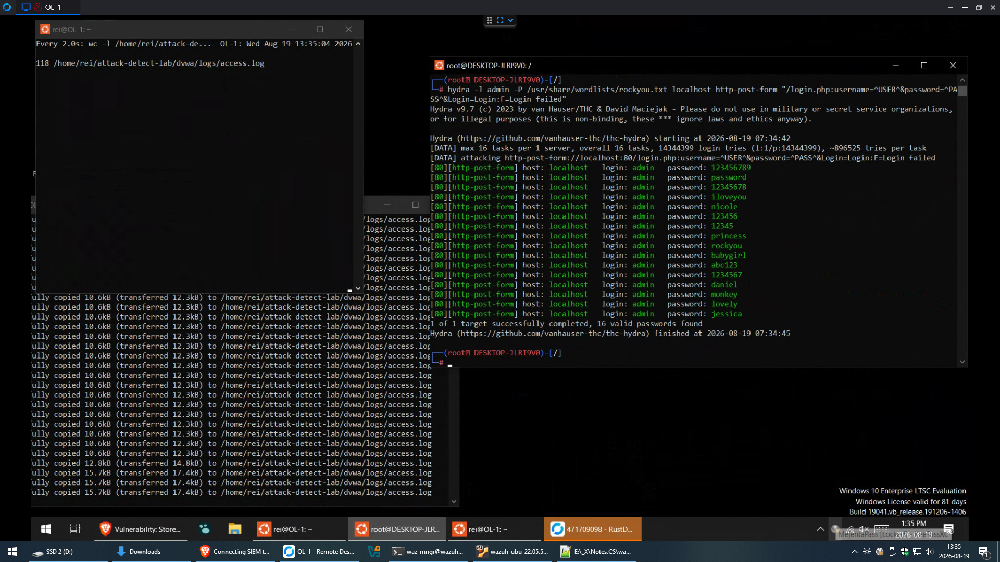

**Result:** confirmed working — 496 total events landed under `manager.name: wazuh-ubu-22045` after syncing DVWA traffic generated for the SQLi/XSS/brute-force write-ups already in [`attack-detect-lab`](https://github.com/hamid0x1/attack-detect-lab/).

---

## 16. Custom detection rules — comparing against `detect.py`

With the agent confirmed sending real DVWA traffic (SQLi, XSS, and Hydra brute-force from the existing [`attack-detect-lab`](https://github.com/hamid0x1/attack-detect-lab/) write-ups), the next step was writing Wazuh detection rules that target the same traffic `detect.py` already analyzes — to compare a SIEM-native ruleset against the earlier Python-based detector.

Before any custom rules existed, Wazuh's own built-in ruleset was already flagging the traffic at a generic level — useful context for why purpose-built rules add value on top of the defaults:

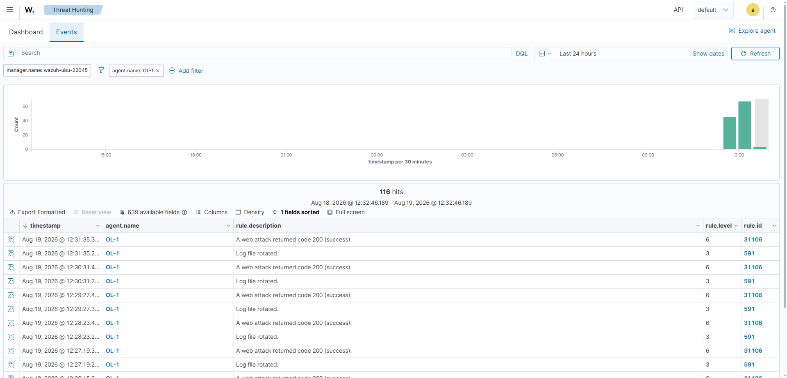

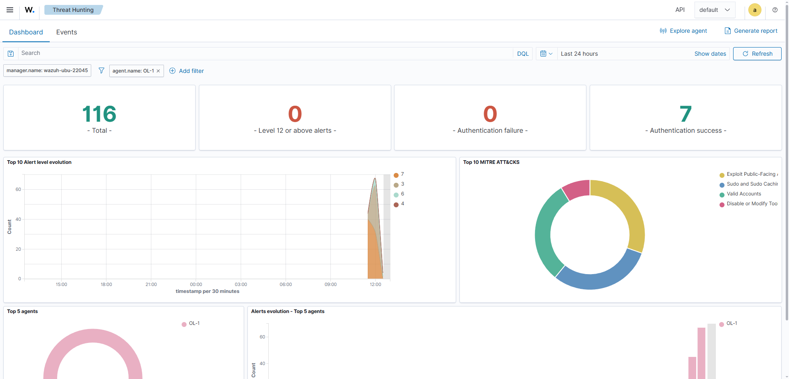

Rules live on the **manager**, not the agent — WSL2 only ships raw logs, all matching/decoding happens server-side:
```bash
sudo nano /var/ossec/etc/rules/local_rules.xml
```

Custom rule IDs must be **100000+** (anything below is reserved for Wazuh's built-in ruleset).

### Final working rules

```xml
<group name="local,syslog,attack-detect-lab,">

  <rule id="100001" level="10">
    <if_sid>31100</if_sid>
    <url>UNION SELECT|union select|' OR '1'='1|--</url>
    <description>SQLi payload detected in DVWA access log (attack-detect-lab)</description>
    <group>sql_injection,attack,</group>
  </rule>

  <rule id="100002" level="10">
    <if_sid>31100</if_sid>
    <url>&lt;script|onerror=|document.cookie</url>
    <description>XSS payload detected in DVWA access log (attack-detect-lab)</description>
    <group>xss,attack,</group>
  </rule>

  <rule id="100010" level="3">
    <if_group>web</if_group>
    <url>login.php</url>
    <description>Request to DVWA login page (baseline)</description>
    <group>attack-detect-lab,</group>
  </rule>

  <rule id="100003" level="10" frequency="6" timeframe="60">
    <if_matched_sid>100010</if_matched_sid>
    <same_source_ip />
    <description>Possible brute-force: repeated requests to DVWA login page within 60s (attack-detect-lab)</description>
    <group>authentication_failures,attack,brute_force,</group>
  </rule>

</group>
```

`100001` and `100002` are direct payload-pattern matches, chained under Wazuh's built-in web-attack rule (`31100`) as a parent. `100003` is frequency-based rather than pattern-based — it fires when its own baseline rule (`100010`, matching any request to `login.php`) repeats 6+ times from the same source IP within 60 seconds, mirroring how Hydra actually behaves rather than matching on a specific string.

Validate before every restart:
```bash
sudo /var/ossec/bin/wazuh-analysisd -t
sudo systemctl restart wazuh-manager
```

### Debugging the two problems hit along the way

**1. Unescaped `<` broke the XML parser**

First attempt at the XSS rule wrote `<url><script|onerror=|...`, and the parser read `<script` as an unclosed XML tag rather than literal text inside `<url>`:
```
ERROR: (1226): Error reading XML file 'etc/rules/local_rules.xml': XMLERR: Element 'script|onerror=|document.cookie</url' not closed.
```
**Fix:** escape it as `&lt;script` — any literal `<` inside an XML value has to be entity-escaped or it gets parsed as markup.

**2. Wrong parent dependency for the brute-force rule**

The brute-force rule originally chained off `<if_matched_sid>5710</if_matched_sid>` — Wazuh's generic syslog/PAM authentication-failure rule (built for things like SSH `Failed password for root`). It never fired, because a failed DVWA login is just an HTTP 200 response with a "Login failed" string in the page body — Apache's access log has no concept of auth success/failure the way PAM does, so rule 5710 was structurally never going to match web traffic. Wrong dependency from the start.

At this stage, SQLi traffic was already being caught (15 hits on rule 100001) while a same-round XSS and Hydra run produced nothing under 100002/100003 — the symptom that led to isolating the brute-force rule's dependency as the actual bug:

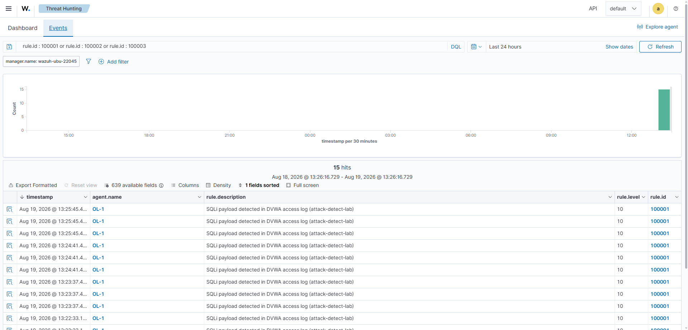

**Fix — traced the correct parent by reading real event JSON instead of guessing:** pulled a raw matched event for the working SQLi rule from the dashboard's Events tab and inspected its `decoder.name` field, which showed `web-accesslog`. That name isn't directly usable as an `if_group` value, though — it's the *decoder* name, not a *rule group*. The actual group came from grepping Wazuh's own shipped ruleset directly for the parent rule:
```bash
sudo bash -c 'grep -B5 "id=\"31100\"" /var/ossec/ruleset/rules/*.xml'
```
This showed rule `31100` sits inside `<group name="web,accesslog,">` — i.e. two separate group tags (`web` and `accesslog`), not one hyphenated string. Rewriting the baseline rule with `<if_group>web</if_group>` (instead of the earlier guesses `web-log` and `web-accesslog`) resolved it immediately — `wazuh-analysisd -t` stopped throwing `Group 'X' was not found` warnings, and the frequency rule started firing correctly on the next Hydra run.

### Result

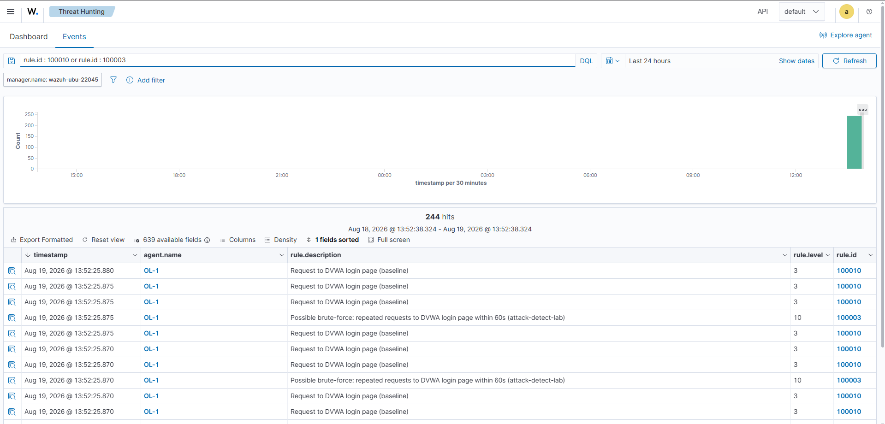

All three custom rules confirmed firing against real [`attack-detect-lab`](https://github.com/hamid0x1/attack-detect-lab/) traffic:

| Rule ID | Attack type | Detection method | Result |
|---|---|---|---|
| 100001 | SQLi | Direct payload-pattern match on `url` field | ✅ Fires reliably |
| 100002 | XSS | Direct payload-pattern match on `url` field | ✅ Fires for URL-based payloads only (see limitation below) |
| 100003 | Brute-force | Frequency (6+ hits/60s from same source IP) on baseline rule 100010 | ✅ Fires correctly after fixing the `if_group` dependency |

### Comparison with `detect.py`

The most interesting finding isn't that the rules worked — it's that Wazuh hit the **exact same documented blind spot** `detect.py` already found: stored/POST-body XSS payloads never appear in a standard Apache `access.log`, since access logs only capture the request line (method, URL, query string), not the POST body. Both a from-scratch Python detector and a mature, production SIEM ruleset share this limitation because it's a property of the log source itself, not a weakness in either tool's logic. That consistency across two independently-built detectors is stronger evidence for the finding than either tool alone.
